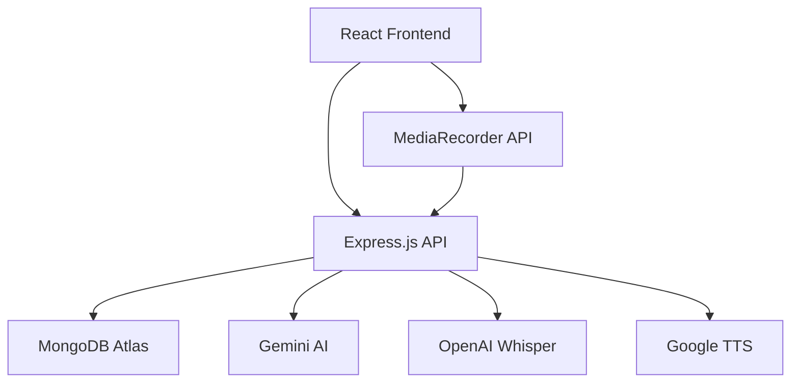

# Mockmate

<div align="center">
  
  <p><em>✨ Watch the magic happen in real-time</em></p>
</div>
MockMate is Interview Preparation using AI with Video Assistant.Engineered a full-stack interview coaching application with all programming domains using React  frontend with  MediaRecorder API  for video capture and  Node.js/Express.js  backend with  MongoDB  for scalable data management and user session persistence. 

Integrated  Gemini API  for question generation and response evaluation, coupled with  Google Text-to-Speech  for natural voice delivery and OpenAI Whisper API  for accurate speech transcription and analysis. 

## Tech Stack

**Client:** React, TailwindCSS

**Server:** Node, Express

**Storage:** MongoDB (Atlas)

**API:** Gemini API, Whisper API, TTS

## Screenshots

| Feature | Screenshot |
|---------|-----------|
| Homepage |  |
| Dashboard |  |
| Mockmate |  |
| Prep Page |  |
| Inteview |  |

## Features

- Designed responsive interface components featuring real-time feedback mechanisms and performance tracking dashboards with CRUD operations, enabling voice-based interactions with under 200ms latency. 

- Configured MongoDB  database schemas  with optimized indexing strategies for efficient storage and retrieval of user profiles, interview sessions, and performance metrics. 

## Quick Start

## Video
### Prerequisites
- Node.js 18+ 
- MongoDB Atlas account
- API keys for Gemini, Whisper, and Google TTS

### Installation

```bash
# Clone the repository
git clone https://github.com/akhilthirunalveli/MockMate.git
cd MockMate

# Install dependencies
npm install
cd client && npm install

# Set up environment variables
cp .env.example .env
# Add your API keys and database URL

# Start the application
npm run dev
```

### Environment Variables

```env
# Database
MONGODB_URI=your_mongodb_connection_string

# API Keys
GEMINI_API_KEY=your_gemini_api_key
OPENAI_API_KEY=your_openai_api_key
GOOGLE_TTS_API_KEY=your_google_tts_key

# Authentication
JWT_SECRET=your_jwt_secret
```

---

## System Architecture


