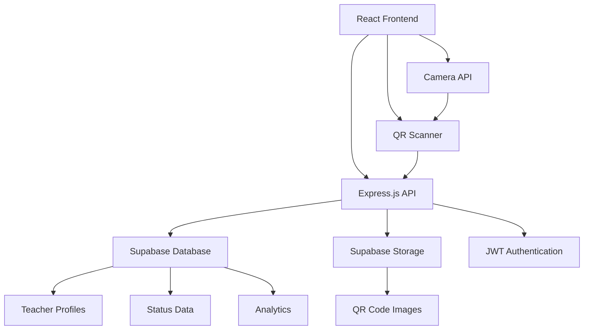

<div align="left">
  
  <h3> KnowMyStatus - Real-time Teacher Status Tracking System</h3>
</div>

KnowMyStatus is a comprehensive teacher monitoring and status tracking system designed for educational institutions. Built with React frontend and Node.js backend, it enables students to instantly check teacher availability through QR code scanning while providing teachers with an intuitive dashboard to manage their status in real-time.

Engineered a full-stack application featuring **QR code generation** and **scanning capabilities**, **real-time status updates**, **admin dashboard** for comprehensive teacher management, and **responsive design** optimized for both mobile and desktop experiences.

## Tech Stack

**Frontend:** React, Vite, TailwindCSS, Lucide Icons

**Backend:** Node.js, Express.js, JWT Authentication

**Database:** Supabase (PostgreSQL)

**Storage:** Supabase Storage for QR codes

**Deployment:** Render (Backend), Vercel (Frontend)

**Libraries:** QRCode.js, React Router, Axios, React Hot Toast

## Screenshots

| Feature | Description |
|---------|-------------|
| **Homepage** | Modern landing page with glassmorphism design and feature highlights |
| **Teacher Dashboard** | Comprehensive status management with analytics and QR code generation |
| **Student Scanner** | QR code scanning interface for instant teacher status checking |
| **Admin Panel** | Advanced teacher management with search, filters, and data export |
| **Mobile Responsive** | Optimized experience across all device sizes |

## Core Features

### 🎯 **For Students**
- **QR Code Scanning**: Instant teacher status checking via camera
- **Teacher Directory**: Browse and search available teachers
- **Department Filtering**: Find teachers by department or subject
- **Mobile Optimized**: Seamless experience on smartphones

### 👨‍🏫 **For Teachers**
- **Status Management**: Real-time availability updates (Available, Busy, On Leave, etc.)
- **QR Code Generation**: Personal QR codes for easy student access
- **Analytics Dashboard**: Track scan statistics and engagement
- **Profile Management**: Update contact information and office details
- **Time-based Status**: Set expected return times for unavailability

### 🔐 **For Administrators**
- **Teacher Management**: Comprehensive overview of all registered teachers
- **Advanced Filtering**: Search by name, department, subject, or status
- **Data Export**: CSV export functionality for reporting
- **Security Features**: Password-protected admin access
- **Real-time Monitoring**: Live status updates across the institution

## System Architecture



## Quick Start

### Prerequisites
- Node.js 18+
- Supabase account
- Modern web browser with camera access

### Installation

```bash
# Clone the repository
git clone https://github.com/akhilthirunalveli/KnowMyStatus-KMS.git
cd KnowMyStatus-KMS

# Install backend dependencies
cd Backend
npm install

# Install frontend dependencies
cd ../Frontend
npm install

# Set up environment variables
cp .env.example .env
# Add your Supabase credentials

# Initialize Supabase storage
cd ../Backend
npm run init-storage

# Start the development servers
# Backend (Terminal 1)
npm run dev

# Frontend (Terminal 2)
cd ../Frontend
npm run dev
```

### Environment Variables

```env
# Supabase Configuration
SUPABASE_URL=your_supabase_project_url
SUPABASE_ANON_KEY=your_supabase_anon_key
SUPABASE_SERVICE_ROLE_KEY=your_supabase_service_role_key

# Authentication
JWT_SECRET=your_jwt_secret_key

# Server Configuration
PORT=5000
NODE_ENV=development
```

## Database Schema

### Teachers Table
```sql
CREATE TABLE teachers (
  id UUID PRIMARY KEY DEFAULT uuid_generate_v4(),
  name VARCHAR(255) NOT NULL,
  email VARCHAR(255) UNIQUE NOT NULL,
  password VARCHAR(255) NOT NULL,
  subject VARCHAR(255),
  department VARCHAR(255),
  phone VARCHAR(20),
  office VARCHAR(100),
  status VARCHAR(50) DEFAULT 'available',
  status_note TEXT,
  status_until TIMESTAMP,
  created_at TIMESTAMP DEFAULT NOW(),
  updated_at TIMESTAMP DEFAULT NOW()
);
```

### QR Scans Table
```sql
CREATE TABLE qr_scans (
  id UUID PRIMARY KEY DEFAULT uuid_generate_v4(),
  teacher_id UUID REFERENCES teachers(id),
  scanned_at TIMESTAMP DEFAULT NOW(),
  scanner_info JSONB
);
```

## API Endpoints

### Authentication
- `POST /api/auth/register` - Teacher registration
- `POST /api/auth/login` - Teacher login
- `GET /api/auth/profile` - Get current user profile
- `PUT /api/auth/profile` - Update user profile

### QR Code Management
- `POST /api/qr/generate` - Generate teacher QR code
- `GET /api/qr/my-qr` - Get current user's QR code
- `POST /api/qr/scan` - Record QR code scan

### Student Access
- `GET /api/students/teachers` - Get all teachers
- `GET /api/students/teacher/:id` - Get specific teacher details
- `GET /api/students/teacher/:id/qr` - Get teacher's QR code
- `GET /api/students/search/:query` - Search teachers
- `GET /api/students/departments` - Get all departments

### Admin Dashboard
- `GET /api/admin/teachers` - Get all teachers (admin only)
- `GET /api/teachers/analytics/me` - Get teacher analytics

## Features in Detail

### 🔄 **Real-time Status Updates**
- Instant status propagation across all student interfaces
- Time-based status expiration
- Persistent QR codes with dynamic data

### 📱 **QR Code Technology**
- High-quality QR code generation using qrcode.js
- Supabase storage integration for scalable image hosting
- Camera-based scanning with real-time feedback

### 🎨 **Modern UI/UX**
- Glassmorphism design with dotted borders
- Responsive grid layouts
- Dark theme optimized for prolonged use
- Smooth animations and transitions

### 🔐 **Security Features**
- JWT-based authentication
- Password-protected admin access
- Secure API endpoints with middleware protection
- Input validation and sanitization

### 📊 **Analytics & Monitoring**
- Scan frequency tracking
- Teacher engagement metrics
- Historical data analysis
- Export capabilities for reporting

## Deployment

### Backend (Render)
```bash
# Build command
npm install && npm run init-storage

# Start command
npm start

# Environment variables
NODE_ENV=production
PORT=10000
SUPABASE_URL=your_production_supabase_url
# ... other env vars
```

### Frontend (Vercel)
```bash
# Build command
npm run build

# Output directory
dist

# Environment variables
VITE_API_BASE_URL=https://your-backend-url.render.com
```

## Contributing

1. Fork the repository
2. Create a feature branch (`git checkout -b feature/amazing-feature`)
3. Commit your changes (`git commit -m 'Add amazing feature'`)
4. Push to the branch (`git push origin feature/amazing-feature`)
5. Open a Pull Request
---
